# Simple Docker

## Оглавление
[Part 1. Готовый докер](#part-1-готовый-докер) \
[Part 2. Операции с контейнером](#part-2-операции-с-контейнером) \
[Part 3. Мини веб-сервер](#part-3-мини-веб-сервер) \
[Part 4. Свой докер](#part-4-свой-докер) \
[Part 5. Dockle](#part-5-dockle) \
[Part 6. Базовый Docker Compose](#part-6-базовый-docker-compose)

## Part 1. Готовый докер

##### Возьми официальный докер-образ с **nginx** и выкачай его при помощи `docker pull`.

- Скачиваю официальный докер-образ **nginx**: \
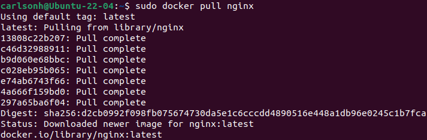

##### Проверь наличие докер-образа через `docker images`.

- Проверяю образ: \
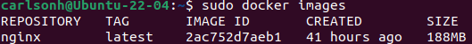

##### Запусти докер-образ через `docker run -d [image_id|repository]`.

- Запускаю образ: \
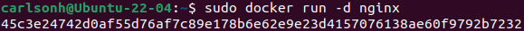

##### Проверь, что образ запустился через `docker ps`.

- Проверяю статус образа: \
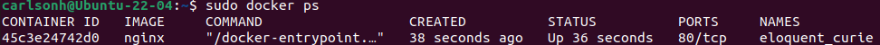

##### Посмотри информацию о контейнере через `docker inspect [container_id|container_name]`.
##### По выводу команды определи и помести в отчёт размер контейнера, список замапленных портов и ip контейнера.

- Проверяю информацию о контейнере:
	-	Размер: \
		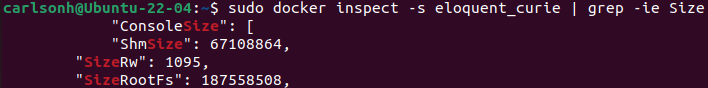

	- Порты: \
		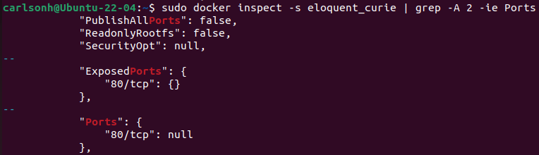

	- IP: \
		

##### Останови докер образ через `docker stop [container_id|container_name]`.
##### Проверь, что образ остановился через `docker ps`.

- Останавливаю образ и проверяю статус: \
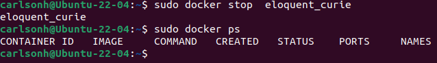

##### Запусти докер с портами 80 и 443 в контейнере, замапленными на такие же порты на локальной машине, через команду *run*.

- Запускаю образ с портами 80 и 443: \
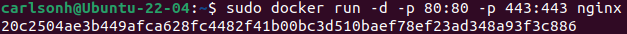

##### Проверь, что в браузере по адресу *localhost:80* доступна стартовая страница **nginx**.

- Проверяю статус **nginx**: \
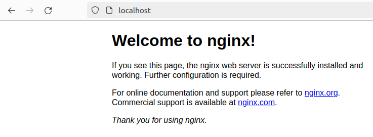

##### Перезапусти докер контейнер через `docker restart [container_id|container_name]`.
##### Проверь любым способом, что контейнер запустился.

- Перезапускаю контейнер: \
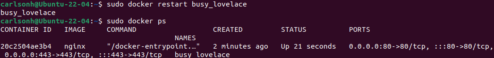

## Part 2. Операции с контейнером

##### Прочитай конфигурационный файл *nginx.conf* внутри докер контейнера через команду *exec*.

- Читаю файл из контейнера: \
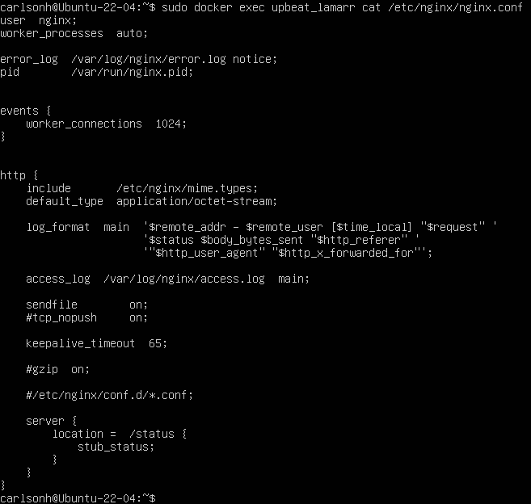

##### Создай на локальной машине файл *nginx.conf*.
##### Настрой в нем по пути */status* отдачу страницы статуса сервера **nginx**.

- Создаю файл *nginx.conf* и настраиваю /status: \
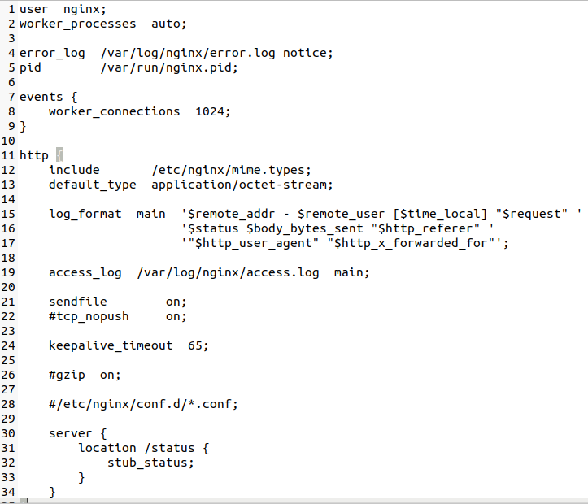

##### Скопируй созданный файл *nginx.conf* внутрь докер-образа через команду `docker cp`.
##### Перезапусти **nginx** внутри докер-образа через команду *exec*.

- Копирую конфиг на контейнер и перезапускаю nginx: \
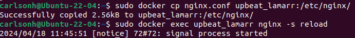

##### Проверь, что по адресу *localhost:80/status* отдается страничка со статусом сервера **nginx**.

- Проверяю адрес *localhost:80/status*: \
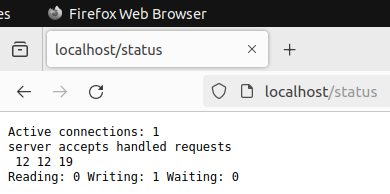

##### Экспортируй контейнер в файл *container.tar* через команду *export*.

- Экспортирую контейнер: \
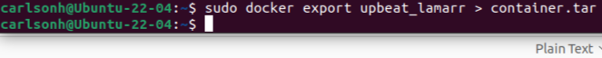

##### Останови контейнер.

- Останавливаю контейнер: \
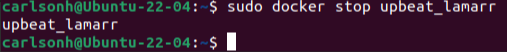

##### Удали образ через `docker rmi [image_id|repository]`, не удаляя перед этим контейнеры.

- Удаляю образ: \
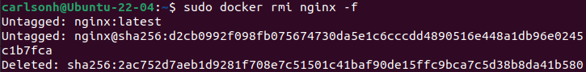

##### Удали остановленный контейнер.

- Удаляю контейнер: \
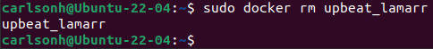

##### Импортируй контейнер обратно через команду *import*.

- Импортирую контейнер: \
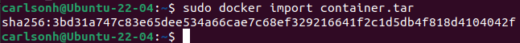

##### Запусти импортированный контейнер.

- Запускаю импортированный контейнер: \
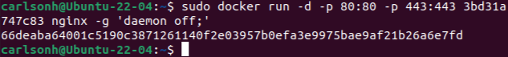

##### Проверь, что по адресу *localhost:80/status* отдается страничка со статусом сервера **nginx**.

- Проверяю статус сервера nginx: \
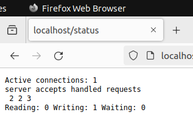


## Part 3. Мини веб-сервер

##### Напиши мини-сервер на **C** и **FastCgi**, который будет возвращать простейшую страничку с надписью `Hello World!`.

- Написал мини-сервер:
	``` c
	#include <fcgi_stdio.h>
	#include <stdio.h>

	int main(void) {
		while(FCGI_Accept() >= 0) {
			printf("Content-type: text/html\r\n\r\nHello World!\r\n\r\n");
		}
		return 0;
	}
	```

- Написал *Makefile* для сборки:
	``` makefile
	CC = gcc
	CFLAGS = -Wall -Werror -Wextra
	LIBS = -lfcgi

	TARGET = miniserver
	SRC_FILES = $(TARGET).c
	OBJ_FILES = $(SRC_FILES:.c=.o)

	all: build

	build: $(OBJ_FILES)
		$(CC) $(CFLAGS) $< -o $(TARGET) $(LIBS)

	$(OBJ_FILES): $(SRC_FILES)
		$(CC) $(CFLAGS) -c $< -o $@ $(LIBS)

	clean:
		rm $(TARGET) *.o

	rebuild: clean build

	.PHONY: all build clean rebuild
	```

- Nginx conf: 
	``` conf
	user nginx;
	worker_processes auto;

	error_log  /var/log/nginx/error.log notice;
	pid        /var/run/nginx.pid;


	events {
			worker_connections 1024;
	}


	http {
			include      /etc/nginx/mime.types;
			default_type application/octet-stream;

			log_format  main  '$remote_addr - $remote_user [$time_local] "$request" '
												'$status $body_bytes_sent "$http_referer" '
												'"$http_user_agent" "$http_x_forwarded_for"';

			access_log  /var/log/nginx/access.log  main;
			sendfile on;
			keepalive_timeout 65;

			server {
					listen 81;
					server_name localhost;

					location / {
							fastcgi_pass 127.0.0.1:8080;
					}

			}
	}

	```


##### Запусти написанный мини-сервер через *spawn-fcgi* на порту 8080.
##### Напиши свой *nginx.conf*, который будет проксировать все запросы с 81 порта на *127.0.0.1:8080*.
##### Проверь, что в браузере по *localhost:81* отдается написанная тобой страничка.

- Скачал *nginx* командой: \
`docker pull nginx`

- Запустил контейнер: \
`sudo docker run -d -p 81:81 --name part3 nginx` \
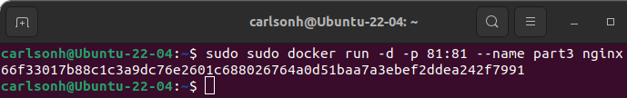

- Скопировал мини-сервер и конфиг nginx на контейнер: 
	- `sudo docker cp nginx.conf part3:/etc/nginx/`
	- `sudo docker cp miniserver/ part3:/home/` \
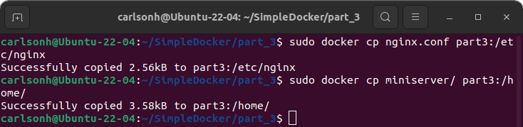

- Запускаю интерактивную оболочку внутри контейнера: \
`sudo docker exec -it part3 bash`

- Устанавливаю на контейнер пакеты для сборки сервера:
	- `apt update`
	- `apt install gcc make spawn-fcgi libfcgi-dev`

- Собираю сервер: \
`make` \
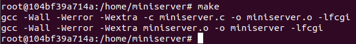

- Запускаю мини сервер через *spawn-fcgi*: \
`spawn-fcgi -p 8080 ./miniserver` \
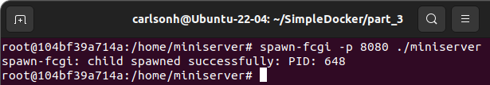

- Перезапускаю *nginx* на контейнере: \
`nginx -s reload`

- Проверяю статус сервера, через браузер: \
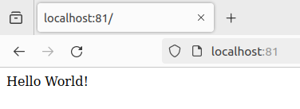

##### Положи файл *nginx.conf* по пути *./nginx/nginx.conf* (это понадобится позже).

## Part 4. Свой докер

#### Напиши свой докер-образ, который:
##### 1) собирает исходники мини сервера на FastCgi из [Части 3](#part-3-мини-веб-сервер);
##### 2) запускает его на 8080 порту;
##### 3) копирует внутрь образа написанный *./nginx/nginx.conf*;
##### 4) запускает **nginx**.
_**nginx** можно установить внутрь докера самостоятельно, а можно воспользоваться готовым образом с **nginx**'ом, как базовым._

- Пишу докер-образ:
	``` Dockerfile

	FROM nginx:latest

	# Установка необходимых пакетов
	RUN apt-get update && \
			apt-get install -y gcc make spawn-fcgi libfcgi-dev nginx

	# Копирование исходников мини сервера
	COPY ./miniserver /home/miniserver

	# Копирование конфигурационного файла nginx
	COPY ./nginx/nginx.conf /etc/nginx/nginx.conf

	# Сборка мини сервера
	RUN cd /home/miniserver && \
			make all

	# Запуск мини сервера и nginx
	CMD spawn-fcgi -p 8080 /home/miniserver/miniserver && nginx -g "daemon off;"
	```

##### Собери написанный докер-образ через `docker build` при этом указав имя и тег.

- `sudo docker build -t part4:1.0 .`

- Написал скрипт для автоматической сборки образа:
	``` bash
	#!/bin/bash
	sudo docker rmi -f simple_docker/part4:1.0 && sudo docker build . -t simple_docker/part4:1.0
	```

##### Проверь через `docker images`, что все собралось корректно.

- Проверяю сборку: \
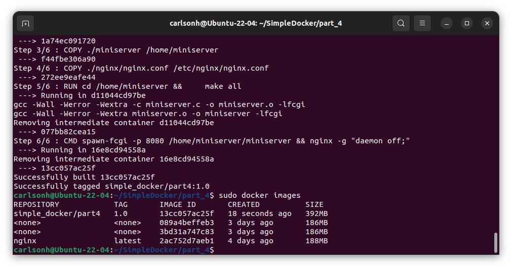

##### Запусти собранный докер-образ с маппингом 81 порта на 80 на локальной машине и маппингом папки *./nginx* внутрь контейнера по адресу, где лежат конфигурационные файлы **nginx**'а (см. [Часть 2](#part-2-операции-с-контейнером)).

- `sudo docker run -d -p 80:81 -v ./nginx/nginx.conf:/etc/nginx/nginx.conf simple_docker/part4:1.0`
- Запускаю контейнер: \
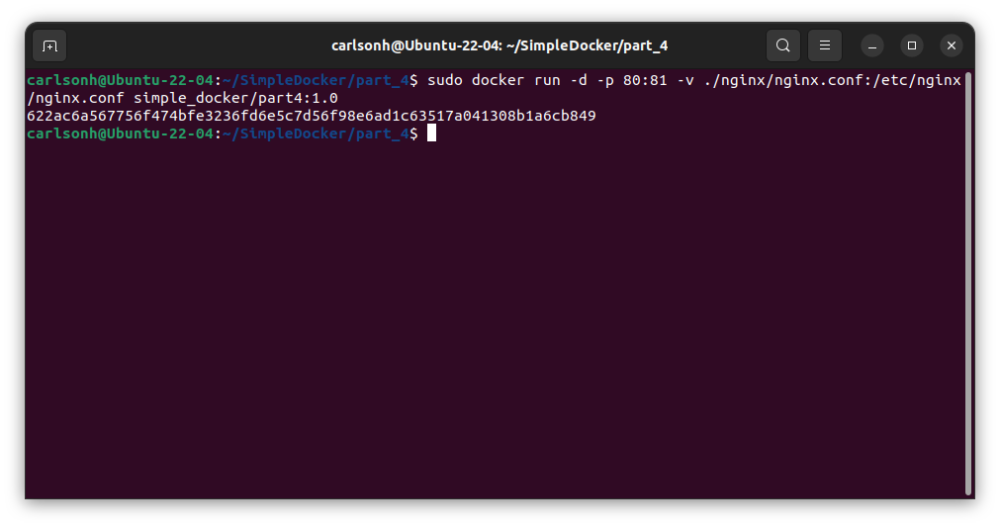

##### Проверь, что по localhost:80 доступна страничка написанного мини сервера.

- Проверяю доступность сервера: \
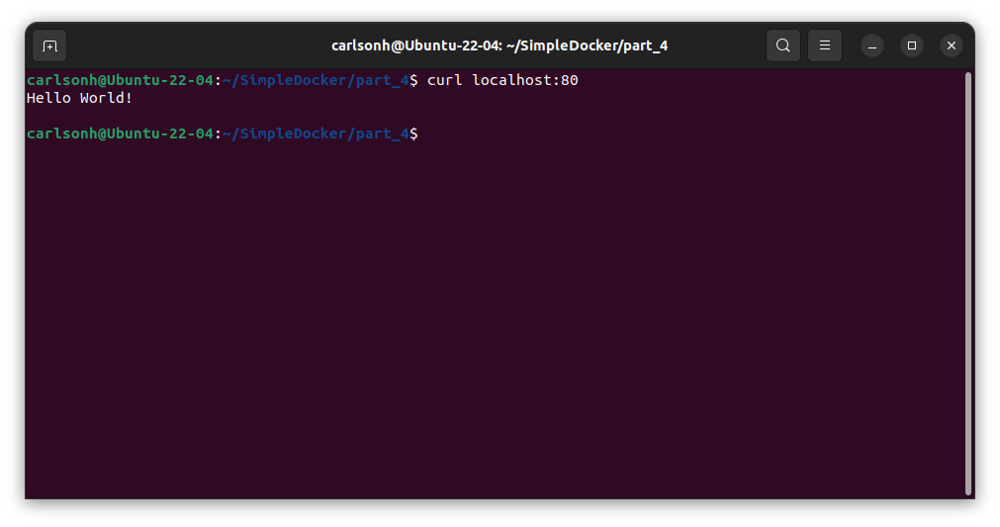

##### Допиши в *./nginx/nginx.conf* проксирование странички */status*, по которой надо отдавать статус сервера **nginx**.

- Дописал конфиг nginx:
	``` conf
	location /status {
			stub_status;
	}
	```

##### Перезапусти докер-образ.
*Если всё сделано верно, то, после сохранения файла и перезапуска контейнера, конфигурационный файл внутри докер-образа должен обновиться самостоятельно без лишних действий*
##### Проверь, что теперь по *localhost:80/status* отдается страничка со статусом **nginx**

- Перезапускаю образ и проверяю, что теперь есть доступ к *localhost:80/status*: \
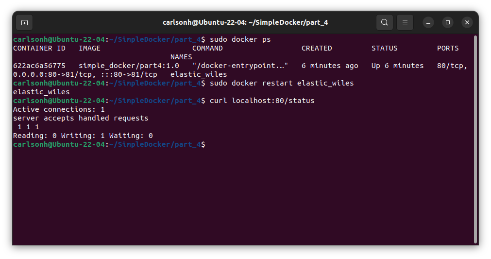

## Part 5. **Dockle**

##### Просканируй образ из предыдущего задания через `dockle [image_id|repository]`.
##### Исправь образ так, чтобы при проверке через **dockle** не было ошибок и предупреждений.

- Для начала нужно установить dockle.
- Перехожу по адресу:
[Github dockle releases](https://github.com/goodwithtech/dockle/releases)
- Скачиваю последню версию dockle в формате *.deb*
- Устанавливаю командой:
`sudo dpkg -i [version_dockle].deb`

- Проверил образ: \
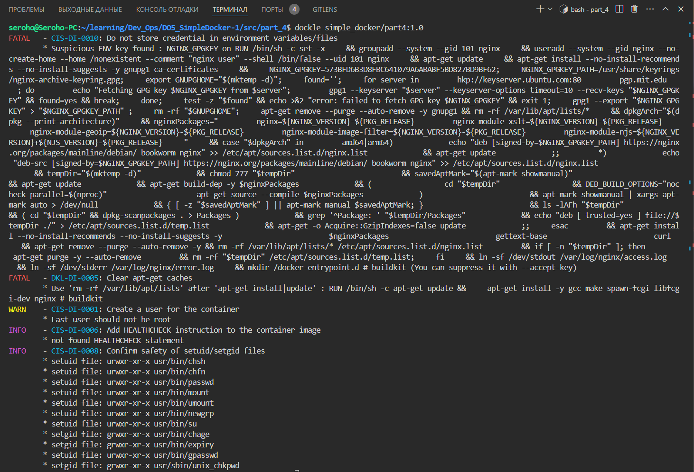

- Исправил докер-файл и скрипт, запускающий его: 

	``` dockerfile
	FROM ubuntu:20.04

	# Установка необходимых пакетов и очистка кэша apt
	RUN apt-get update && \
			apt-get install -y gcc make spawn-fcgi libfcgi-dev nginx curl && \
			rm -rf /var/lib/apt/lists/*

	# Копирование исходников мини сервера
	COPY ./miniserver /home/miniserver

	# Копирование конфигурационного файла nginx
	COPY ./nginx/nginx.conf /etc/nginx/nginx.conf

	# Сборка мини сервера
	RUN cd /home/miniserver && \
			make all

	RUN chmod 755 \
			/usr/bin/passwd \
			/usr/bin/mount \
			/usr/bin/umount \
			/usr/sbin/unix_chkpwd \
			/usr/bin/gpasswd \
			/usr/sbin/pam_extrausers_chkpwd \
			/usr/bin/chfn \
			/usr/bin/chsh \
			/usr/bin/newgrp \
			/usr/bin/su \
			/usr/bin/chage \
			usr/bin/expiry

	RUN useradd -ms /bin/bash carlsonh \
			&& chown -R carlsonh:carlsonh /usr/bin \
			&& chown -R carlsonh:carlsonh /usr/sbin \
			&& chown -R carlsonh:carlsonh /var \
			&& chown -R carlsonh:carlsonh /run

	# Смена пользователя на nginx
	USER carlsonh

	# Запуск мини сервера и nginx
	CMD spawn-fcgi -p 8080 /home/miniserver/miniserver && nginx -g "daemon off;"

	HEALTHCHECK --interval=5m --timeout=3s \
		CMD curl -f http://localhost:80 || exit 1
	```

- Скрипт: 
	``` bash
	#!/bin/bash
	export DOCKER_CONTENT_TRUST=1

	sudo docker rmi simple_docker/part5:1.0 -f 
	sudo docker build . -t simple_docker/part5:1.0
	```

- Написал скрипт для запуска сервера fcgi;

- Проверяю dockle после внесенных изменений: \
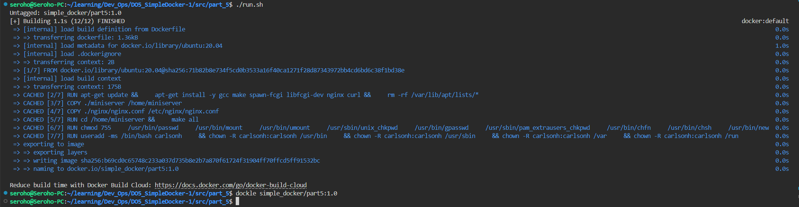

- Запускаю сервер и проверяю его работу: \
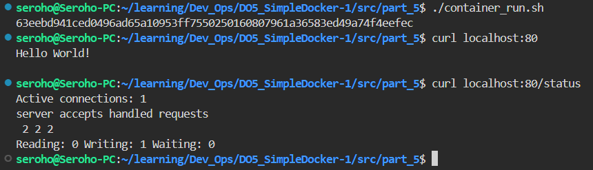

## Part 6. Базовый **Docker Compose**

Вот ты и закончил свою разминку. А хотя погоди...
Почему бы не поэкспериментировать с развёртыванием проекта, состоящего сразу из нескольких докер-образов?

**== Задание ==**

##### Напиши файл *docker-compose.yml*, с помощью которого:
##### 1) Подними докер-контейнер из [Части 5](#part-5-инструмент-dockle) _(он должен работать в локальной сети, т.е. не нужно использовать инструкцию **EXPOSE** и мапить порты на локальную машину)_.
##### 2) Подними докер-контейнер с **nginx**, который будет проксировать все запросы с 8080 порта на 81 порт первого контейнера.
##### Замапь 8080 порт второго контейнера на 80 порт локальной машины.

##### Останови все запущенные контейнеры.
##### Собери и запусти проект с помощью команд `docker-compose build` и `docker-compose up`.
##### Проверь, что в браузере по *localhost:80* отдается написанная тобой страничка, как и ранее.

💡 [Нажми сюда](https://forms.yandex.ru/cloud/6418195450569020f1f159c4/), **чтобы поделиться с нами обратной связью на этот проект**. Это анонимно и поможет команде Продукта сделать твоё обучение лучше.
